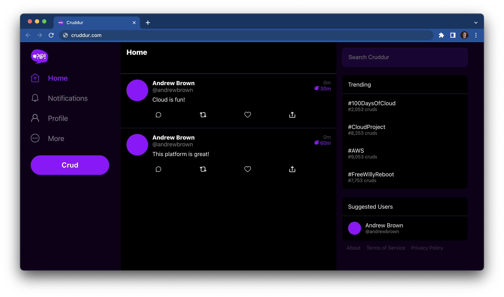

# FREE AWS Cloud Project Bootcamp


- Application: Cruddur
- Cohort: 2023-A1

This is the codebase for the FREE AWS Cloud Project Bootcamp 2023. This repository has been configured to work seamlessly in both **Gitpod** (cloud development environment) and **local desktop environments**.




---

## 🚀 Quick Start

### Running in Gitpod (Recommended for Beginners)

1. **Open in Gitpod**: Click the Gitpod button or open this repository in Gitpod
2. **Wait for setup**: The environment will automatically configure itself
3. **Start the application**:
   ```bash
   docker-compose up -d
   ```
4. **Access the app**: Gitpod will provide URLs for:
   - Frontend: `https://3000--<your-environment-id>.gitpod.dev`
   - Backend API: `https://4567--<your-environment-id>.gitpod.dev`

### Running Locally (Desktop/Laptop)

1. **Clone the repository**:
   ```bash
   git clone https://github.com/YOUR-USERNAME/aws-bootcamp-cruddur-2023.git
   cd aws-bootcamp-cruddur-2023
   ```

2. **Copy local environment configuration**:
   ```bash
   cp .env.local .env
   ```

3. **Start the application**:
   ```bash
   docker-compose up -d
   ```

4. **Access the app**:
   - Frontend: http://localhost:3000
   - Backend API: http://localhost:4567

---

## 📚 What's Inside

This application is a microservices-based social media platform called **Cruddur**. It consists of:

| Service | Technology | Port | Description |
|---------|-----------|------|-------------|
| **Frontend** | React.js | 3000 | User interface for the application |
| **Backend** | Python Flask | 4567 | REST API for business logic |
| **Database** | PostgreSQL | 5432 | Relational database for user data |
| **DynamoDB Local** | AWS DynamoDB | 8000 | NoSQL database for messages |
| **X-Ray Daemon** | AWS X-Ray | 2000 | Distributed tracing service |

---

## 🔧 Recent Configuration Changes

This repository has been updated to work in both Gitpod and local environments. Here's what changed and why:

### 1. Environment Variable System

**What Changed:**
- Created `.env.gitpod` - Configuration template for Gitpod
- Created `.env.local` - Configuration template for local development
- Updated `docker-compose.yml` to use environment variables instead of hardcoded values

**Why This Matters:**
The original configuration used Gitpod Classic variables (`GITPOD_WORKSPACE_ID`, `GITPOD_WORKSPACE_CLUSTER_HOST`) that don't exist in the new Gitpod. The new system uses:
- `GITPOD_ENVIRONMENT_ID` for Gitpod
- `localhost` for local development

**How It Works:**
```yaml
# Old way (hardcoded):
FRONTEND_URL="https://3000-${GITPOD_WORKSPACE_ID}.${GITPOD_WORKSPACE_CLUSTER_HOST}"

# New way (flexible):
FRONTEND_URL=${FRONTEND_URL}
```

The actual URL is now defined in your `.env` file, which you copy from either `.env.gitpod` or `.env.local` depending on where you're running.

### 2. Docker Compose Updates

**What Changed:**
- Removed obsolete `version: "3.8"` field
- Added explicit network configuration to all services
- Added anonymous volume for `node_modules` in frontend service
- Added default values for optional environment variables

**Why This Matters:**

**Network Configuration:**
```yaml
networks:
  - internal-network
```
This ensures all services (backend, frontend, database, etc.) can communicate with each other using service names. For example, the backend can connect to the database using `db:5432` instead of an IP address.

**Node Modules Volume:**
```yaml
volumes:
  - ./frontend-react-js:/frontend-react-js
  - /frontend-react-js/node_modules  # This line is new
```
Without this, the local `frontend-react-js` folder would overwrite the `node_modules` installed inside the Docker container, causing the React app to fail with "react-scripts: not found" errors.

**Default Values:**
```yaml
HONEYCOMB_API_KEY=${HONEYCOMB_API_KEY:-}
```
The `:-` syntax means "use empty string if not set", preventing Docker Compose from showing warnings about undefined variables.

### 3. Security Improvements

**What Changed:**
- Added `.gitignore` file at repository root
- Removed `.env` from git tracking
- `.env` now contains your actual API keys (not tracked in git)
- `.env.gitpod` and `.env.local` are templates (tracked in git, no secrets)

**Why This Matters:**
Your `.env` file contains sensitive information like:
```bash
HONEYCOMB_API_KEY=your-actual-api-key-here
```

If this was committed to GitHub, anyone could see and use your API key. Now:
- ✅ `.env` is in `.gitignore` (never committed)
- ✅ `.env.gitpod` and `.env.local` are templates (safe to commit)
- ✅ You copy the template and add your own keys locally

### 4. Documentation

**What Changed:**
- Created `SETUP.md` - Detailed setup instructions
- Updated `README.md` - This file, explaining all changes

**Why This Matters:**
New team members or contributors can understand:
- How to run the application
- What each service does
- How to switch between environments
- What changed and why

---

## 🌐 Understanding Gitpod URLs

### Old Gitpod Classic Format
```
https://3000-${GITPOD_WORKSPACE_ID}.${GITPOD_WORKSPACE_CLUSTER_HOST}
```

### New Gitpod Format
```
https://3000--${GITPOD_ENVIRONMENT_ID}.eu-central-1-01.gitpod.dev
```

**Key Differences:**
- Uses `GITPOD_ENVIRONMENT_ID` instead of `WORKSPACE_ID`
- Uses `--` (double dash) instead of `-` (single dash)
- Includes region in the URL (`eu-central-1-01`)

**Example:**
If your `GITPOD_ENVIRONMENT_ID` is `019ad5fc-0eb7-79d0-94dd-58404fe8acd5`, your URLs will be:
- Frontend: `https://3000--019ad5fc-0eb7-79d0-94dd-58404fe8acd5.eu-central-1-01.gitpod.dev`
- Backend: `https://4567--019ad5fc-0eb7-79d0-94dd-58404fe8acd5.eu-central-1-01.gitpod.dev`

---

## 📖 Detailed Setup Guide

For step-by-step instructions, troubleshooting, and advanced configuration, see [SETUP.md](SETUP.md).

---

## 🔍 Understanding the Architecture

### How Services Communicate

```
┌─────────────┐         ┌─────────────┐
│   Browser   │────────▶│  Frontend   │
│             │         │  (React)    │
└─────────────┘         │  Port 3000  │
                        └──────┬──────┘
                               │
                               │ HTTP Requests
                               ▼
                        ┌─────────────┐
                        │   Backend   │
                        │   (Flask)   │
                        │  Port 4567  │
                        └──────┬──────┘
                               │
                ┌──────────────┼──────────────┐
                │              │              │
                ▼              ▼              ▼
         ┌───────────┐  ┌───────────┐  ┌───────────┐
         │ PostgreSQL│  │ DynamoDB  │  │  X-Ray    │
         │ Port 5432 │  │ Port 8000 │  │ Port 2000 │
         └───────────┘  └───────────┘  └───────────┘
```

### Environment Variables Flow

```
1. You copy template:
   cp .env.gitpod .env  (in Gitpod)
   OR
   cp .env.local .env   (on desktop)

2. Docker Compose reads .env:
   FRONTEND_URL=${FRONTEND_URL}
   
3. Variables are injected into containers:
   Backend knows where Frontend is
   Frontend knows where Backend is
   
4. Services can communicate!
```

---

## 🛠️ Common Commands

### Docker Compose Commands
```bash
# Start all services
docker-compose up -d

# Stop all services
docker-compose down

# View running services
docker-compose ps

# View logs (all services)
docker-compose logs -f

# View logs (specific service)
docker-compose logs -f backend-flask

# Rebuild and restart
docker-compose up -d --build

# Stop and remove everything (including volumes)
docker-compose down -v
```

### Switching Environments
```bash
# Switch to Gitpod configuration
cp .env.gitpod .env
docker-compose restart

# Switch to local configuration
cp .env.local .env
docker-compose restart
```

---

## 🐛 Troubleshooting

### "Permission denied" error in Gitpod
```bash
sudo chmod 666 /var/run/docker.sock
```

### Frontend shows "Cannot connect to backend"
1. Check backend is running: `docker-compose ps`
2. Verify `.env` file has correct URLs for your environment
3. Check backend logs: `docker-compose logs backend-flask`

### "react-scripts: not found" error
This is fixed by the anonymous volume in docker-compose.yml. If you still see it:
```bash
docker-compose down
docker-compose up -d --build
```

### Services won't start
```bash
# Check Docker is running
docker ps

# Check for port conflicts
lsof -i :3000
lsof -i :4567

# View detailed logs
docker-compose logs
```

---

## 📝 Environment Variables Reference

| Variable | Purpose | Gitpod Value | Local Value |
|----------|---------|--------------|-------------|
| `FRONTEND_URL` | Where frontend is accessible | `https://3000--${GITPOD_ENVIRONMENT_ID}...` | `http://localhost:3000` |
| `BACKEND_URL` | Where backend is accessible | `https://4567--${GITPOD_ENVIRONMENT_ID}...` | `http://localhost:4567` |
| `REACT_APP_BACKEND_URL` | Backend URL for React app | Same as BACKEND_URL | `http://localhost:4567` |
| `AWS_XRAY_URL` | X-Ray daemon URL pattern | Gitpod URL pattern | `*localhost:4567*` |
| `HONEYCOMB_API_KEY` | Honeycomb observability API key | Your key (not in git) | Your key (not in git) |
| `HONEYCOMB_DATASET` | Honeycomb dataset name | `cruddur` | `cruddur` |
| `SERVICE_NAME` | Service identifier | `backend-flask` | `backend-flask` |

---

## 🎓 Learning Resources

### Understanding Docker Compose
- [Docker Compose Documentation](https://docs.docker.com/compose/)
- [Docker Compose Networking](https://docs.docker.com/compose/networking/)

### Understanding Gitpod
- [Gitpod Documentation](https://www.gitpod.io/docs)
- [Gitpod Environment Variables](https://www.gitpod.io/docs/configure/projects/environment-variables)

### Understanding the Stack
- **Flask**: [Flask Documentation](https://flask.palletsprojects.com/)
- **React**: [React Documentation](https://react.dev/)
- **PostgreSQL**: [PostgreSQL Documentation](https://www.postgresql.org/docs/)

---

## 📂 Project Structure

```
aws-bootcamp-cruddur-2023/
├── backend-flask/           # Python Flask API
│   ├── app.py              # Main application entry point
│   ├── requirements.txt    # Python dependencies
│   ├── Dockerfile          # Backend container configuration
│   └── services/           # Business logic modules
├── frontend-react-js/       # React frontend
│   ├── src/                # React source code
│   ├── public/             # Static assets
│   ├── package.json        # Node.js dependencies
│   └── Dockerfile          # Frontend container configuration
├── docker-compose.yml       # Multi-container orchestration
├── .env.gitpod             # Gitpod environment template
├── .env.local              # Local environment template
├── .env                    # Active configuration (not in git)
├── .gitignore              # Git ignore rules
├── SETUP.md                # Detailed setup instructions
├── README.md               # This file
└── journal/                # Weekly homework documentation
```

---

## 🤝 Contributing

When contributing to this repository:

1. Never commit `.env` files with real API keys
2. Use `.env.gitpod` or `.env.local` as templates
3. Test changes in both Gitpod and local environments
4. Update documentation if you change configuration

---

## 📋 Journaling Homework

The `/original bootcamp journal` directory contains weekly homework documentation:

- [ ] [Week 0](journal/week00.md)
- [ ] [Week 1](journal/week01.md)
- [ ] [Week 2](journal/week02.md)
- [ ] [Week 3](journal/week03.md)
- [ ] [Week 4](journal/week04.md)
- [ ] [Week 5](journal/week05.md)
- [ ] [Week 6](journal/week06.md)
- [ ] [Week 7](journal/week07.md)
- [ ] [Week 8](journal/week08.md)
- [ ] [Week 9](journal/week09.md)
- [ ] [Week 10](journal/week10.md)
- [ ] [Week 11](journal/week11.md)
- [ ] [Week 12](journal/week12.md)
- [ ] [Week 13](journal/week13.md)

---

## 📞 Getting Help

If you encounter issues:

1. Check [SETUP.md](SETUP.md) for detailed troubleshooting
2. Review the error messages in `docker-compose logs`
3. Verify your `.env` file matches your environment
4. Check that all services are running with `docker-compose ps`

---

## 📄 License

This project is part of the FREE AWS Cloud Project Bootcamp 2023.
